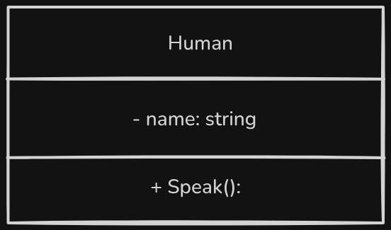
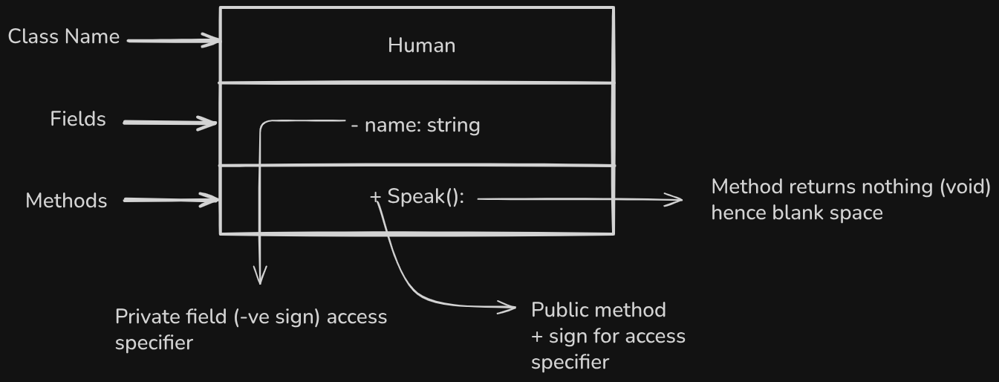
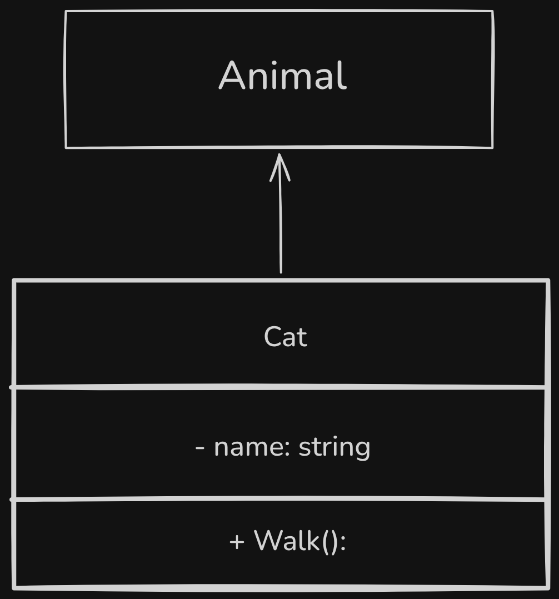
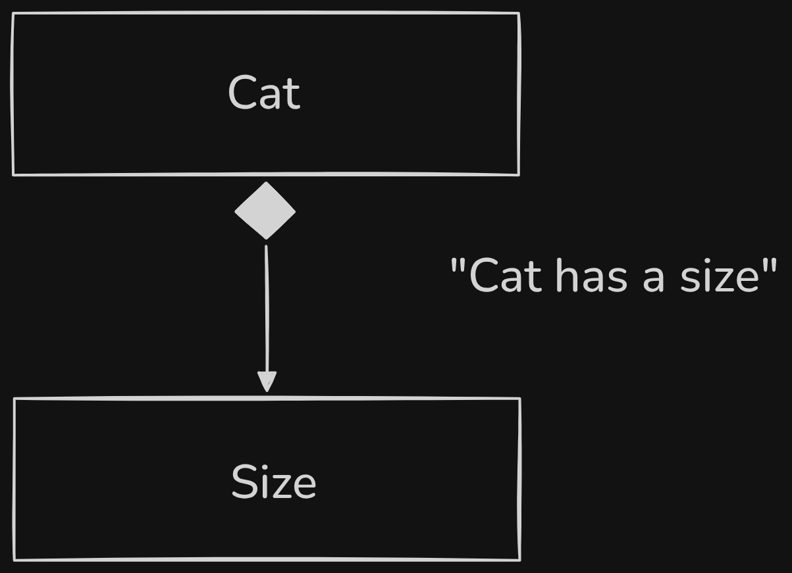

# What is UML?
`UML is a language used to model systems - the relationships between classes`

---

# Representing a class:

```C#
public class Human
{
    private string name;

    public void Speak()
    {
        System.Console.WriteLine("Hello world!");
    }
}
```

## The above class can be represented in UML as:




## Explanation



---

# Inheritance Relationship

### Code:

```C#
public class Cat : Animal
{
    string name;

    public void Walk()
    {
        System.Console.WriteLine("Started cat's walk!");
    }
}
```

### UML Diagram:



- <strong> Inheritance relationships are represented by an arrow </strong>
- <strong> It an "Is a" relationship. </strong>

Above we could see the Cat class inherits/extends the Animal class.

---

# Composition Relationship

<strong> Represented by an arrow with a filled diamond. </strong>

```C#
public class Cat
{
    private Size size;
}
```

## UML Diagram:

